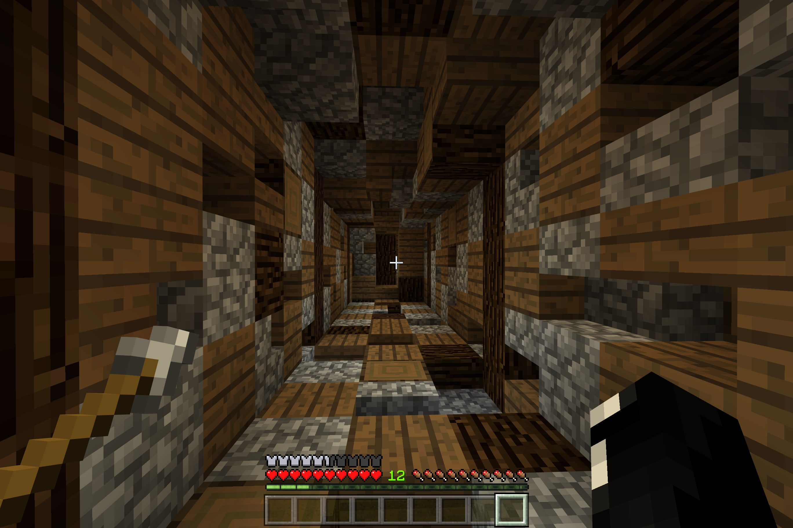

# HideCoords

HideCoords is a simple resource pack that hides coordinates, even if they are turned on in the world settings - useful if you're on a realm or world with them turned on and you want them off for yourself, but still on for others (e.g. while recording/streaming on a realm).

To use it, simply download and open the [`HideCoords.mcpack`](https://raw.githubusercontent.com/TheDragonRing/hidecoords/master/HideCoords.mcpack) file.

_For Minecraft: Bedrock Edition (Windows 10, iOS, Android + more...)_

---

Here's a picture. It's not very interesting to just look at some grass and the sky, so I took a screenshot of a tunnel instead. You can't see any coordinates in the picture because I'm using HideCoords.

